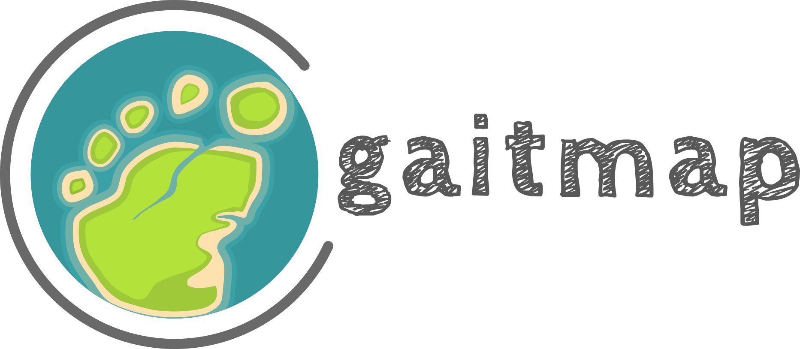

[](https://pypi.org/project/gaitmap/)
[](https://github.com/mad-lab-fau/gaitmap/actions/workflows/test-and-lint.yml)
[](https://codecov.io/gh/mad-lab-fau/gaitmap)
[](https://gaitmap.readthedocs.io/en/latest/?badge=latest)
[](https://github.com/psf/black)


# gaitmap - The Gait and Movement Analysis Package

*gaitmap* provides a set of algorithms to analyze your IMU movement data (with a focus on foot-worn IMUs) without 
getting into your way.

- 💻 20+ Algorithms from 17+ publications
- 📚 Extensive documentation
- 📝 Build to be easily extensible
- ⚙️ Familiar API inspired by scikit-learn
- 🤝 Interoperable with the other libraries from the gaitmap ecosystem ([gaitmap-dataset](https://github.com/mad-lab-fau/gaitmap-datasets), [tpcp](https://github.com/mad-lab-fau/tpcp), ...)

**Documentation:** [gaitmap.readthedocs.io](https://gaitmap.readthedocs.io/en/latest/)
**Learn More about the gaitmap ecosystem:** TODO: Website Link

## Installation

Gaitmap is split into two packages: `gaitmap` and `gaitmap_mad` ([Learn more](TODO: Link to gaitmap_mad docu page).
To get access to all available algorithms, you need to install both packages.

```
pip install gaitmap gaitmap_mad --upgrade
```

Both packages are always released together and have the same version number.
We don't recommend mixing different versions of `gaitmap` and `gaitmap_mad`.

**Note:** gaitmap-mad is published under a AGPL-3.0 license, while gaitmap is published under a MIT license.
Please, check the [License](#license) section below for more details.

In case you are sure that AGPL-3.0 is compatible with your project, you can install `gaitmap_mad` without any downsides.
Otherwise, just install `gaitmap` and check the API-docu page of the individual algorithms if they are available in
`gaitmap` only.

### Enabling specific features

#### Hidden Markov Models

To use the HMM (anything imported from `gaitmap.stride_segmentation.hmm`) based algorithms make sure you install `gaitmap` with the `hmm` extra.

```
pip install gaitmap_mad "gaitmap[hmm]" --upgrade
```
This installs the `pomegranate` package, which is the basis for the HMM implementation.
Note, that we only support the `pomegranate` version `>=0.14.2,<=0.14.6` and that `pomegrante` is not compatible with 
Python 3.10.

We are working on upgrading to a newer version of `pomegranate`, but this is not a priority at the moment.
You can track the progress in the [pull request](https://github.com/mad-lab-fau/gaitmap/pull/20).

### Supported Python versions

*gaitmap* is tested against Python 3.8 and 3.9 at the moment.
We expect most features to work with all Python versions >= 3.8, but because of some known issues 
(see specific features above) we do not officially support them.

## Working with Algorithms

*gaitmap* is designed to be a toolbox and not a single algorithm.
This means, that you are expected to pick and use individual algorithms.

To get started with *gaitmap* we recommend to follow these steps:

1. Understand the common datatypes we use: [Common Datatypes](https://gaitmap.readthedocs.io/en/latest/source/user_guide/datatypes.html), [Coordinate Systems](https://gaitmap.readthedocs.io/en/latest/source/user_guide/coordinate_systems.html)
2. Learn how to prepare your own data (or play around with example data): TODO 
3. Check the API docs and examples for available algorithms: [API Docs](https://gaitmap.readthedocs.io/en/latest/modules/index.html), [Examples](https://gaitmap.readthedocs.io/en/latest/auto_examples/index.html)

Each algorithm is implemented as a class, which is initialized with the required parameters.
In many cases the default parameters are sufficient, but to get the best results on your data, you should adapt them.

```python
from gaitmap.stride_segmentation import BarthDtw

stride_segmenter = BarthDtw(max_cost=2.5)
```

After initialization, you can apply the algorithm to your data (each group of algorithm has a different action method):

```python
my_imu_data = ...
stride_segmenter.segment(my_imu_data, sampling_rate_hz=204.8)
```

Results are stored as parameters of the algorithm object (with a trailing underscore):

```python
segmented_strides = stride_segmenter.stride_list_
```

Most algorithms have additional results available to provide further information.

```python
dtw_warping_path = stride_segmenter.paths_
```

To build a full gait analysis pipeline you can combine multiple algorithms ([Example](https://gaitmap.readthedocs.io/en/latest/auto_examples/full_pipelines/mad_gait_pipeline.html#sphx-glr-auto-examples-full-pipelines-mad-gait-pipeline-py)).
You can even substitute your own algorithms ([Guide](https://gaitmap.readthedocs.io/en/latest/source/user_guide/create_own_algorithm.html)) or use the provided tooling to validate
and optimize your algorithms using tpcp ([Guide](https://tpcp.readthedocs.io/en/latest/guides/index.html#optimization-and-validation)).

## Citation

If you use *gaitmap* in your research we would appreciate a citation.
This helps us to justify the time we invest in the development and maintenance of the library.

We currently prepare a paper to describe the *gaitmap* library in detail.
Until then, please simply cite the repository.


If you use a specific algorithm please also make sure you cite the original paper of the algorithm!
We recommend the following citation style:

*We used the algorithm proposed by Author et al. [paper-citation], implemented by the Gaitmap package [gaitmap-citation].*

## License

The *gaitmap* (which includes most algorithms) is published under a [MIT license](https://opensource.org/license/mit/).
This is a permissive license, which allows you to use the code in nearly any way you want, as long as you include the
original license in you modified version.

*gaitmap_mad* is published under a AGPL-3.0 license.
This only affects algorithms that were developed by the [MaD Lab](https://www.mad.tf.fau.de/) in collaboration with industry partners.
The AGPL-3.0 license is a copyleft license, which if you integrate **gaitmap_mad** into your software and provide it to 
others (either as a service or as a product), you have to publish your software under a compatible open source license.
Please, check the [AGPL-3.0 license](https://www.gnu.org/licenses/agpl-3.0.en.html) for more details and make sure
you understand the implications.

If you need to use *gaitmap_mad* in a closed source project, please contact us for a potential commercial license.

## For Developers

The [Development Guides](https://gaitmap.readthedocs.io/en/latest/source/development/index.html#development) have detailed information for all new developers.

Here some quick references
Install Python >=3.8 and [poetry](https://python-poetry.org).
Then run the commands below to get the latest source and install the dependencies:

```bash
git clone https://github.com/mad-lab-fau/gaitmap.git
# For Python 3.8 and 3.9 (and if you need to work on hmm)
poetry install --all-extras
# For Python >=3.10 (you can not work on hmm stuff with this)
poetry install -E stats
```

Warning: Building the docs currently only works in 3.8 and 3.9 with all extras installed.

Note, that you don't need to care about the `gaitmap_mad` subpackage.
All dependencies are specified in the main `pyproject.toml` and the `gaitmap_mad` will be installed in editable mode
when running `poetry install`.

To run any of the tools required for the development workflow, use the poe commands:

```bash
poetry run poe
...
CONFIGURED TASKS
  format            
  lint              Lint all files with Prospector.
  check             Check all potential format and linting issues.
  test              Run Pytest with coverage.
  docs              Build the html docs using Sphinx.
  register_jupyter  Register the gaitmap environment as a Jupyter kernel for testing.
  version           Bump version in all relevant places.
  bump_dev          Update all dev dependencies to their @latest version.

```
